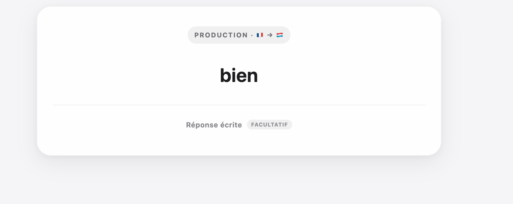
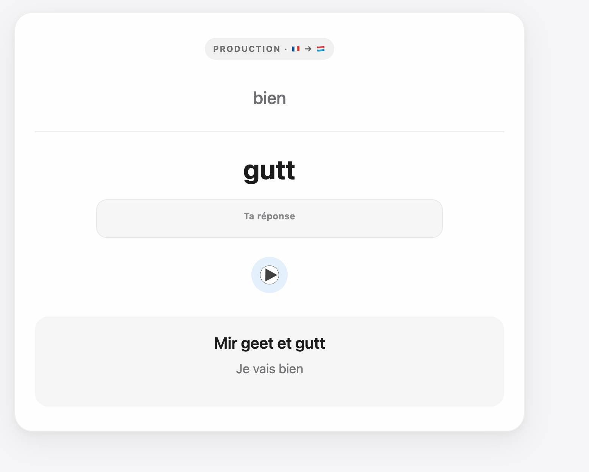

# 🇱🇺 Luxki - Apprenons le Luxembourgeois ! 

## Qu'est-ce que Luxki ? 

**Luxki**  est un paquet de cartes Anki destiné aux francophones qui apprennent le luxembourgeois. 

Son nom vient de la contraction de  **Lux**embourg et An**ki**.

L'objectif : proposer une base de vocabulaire et de phrases prête à l'emploi, accompagnée de prononciations audio, tout en profitant de la répétition espacée d'Anki.

## Qu'est-ce que la répétition espacée ? 

Anki repose sur le principe de la  **répétition espacée**  : plutôt que de réviser toutes les cartes à intervalles réguliers, le logiciel adapte progressivement le délai entre deux révisions en fonction de vos réponses.

[Clique ici pour accéder à une BD interactive pour tout comprendre de la répétition espacée](https://ncase.me/remember/fr.html)

## Exemple de carte
### Avant 

### Arrière

## Pourquoi Luxki plutôt que de créer mes propres cartes dans Anki ?

Et bien ... pourquoi choisir ? 

En fonction des cours que vous suivez par ailleurs, il peut être tout à fait pertinent d'avoir votre propre deck/paquet et d"utiliser celui-ci en plus. 

Néanmoins voici quelques avantages que Luxki : 

 **⚡ Prêt à l'emploi** :

Les cartes sont déjà créées, ce qui vous épargne un travail considérable de recherche et de mise en forme.

**🤝 Fait ensemble, pour tous**  : 

Luxki est un projet collaboratif. Une erreur, une meilleure traduction ou une nouvelle phrase à proposer ? Les contributions sont les bienvenues via GitHub.

**🗣️ Synthese vocale** :

Elle permet d'apprendre et d'entendre la prononciation d'un mots afin de ne pas apprendre d'erreur de prononciation.

## 🤝 Contribuer

Luxki est un projet collaboratif.

Vous avez repéré une faute, une traduction discutable ou un problème de prononciation ? Ouvrez une  **Issue**.

Vous souhaitez ajouter ou modifier plusieurs entrées ? Vous pouvez proposer directement une  **Pull Request**.

Les données utilisées pour générer Luxki sont disponibles dans le dossier  `data/`.

## 📥 Installation

### 1. Installer Anki

[Video (en anglais) de quelques minutes pour apprendre à utiliser Anki](https://www.youtube.com/watch?v=tufDp32VaTw)

### 2. Télécharger Luxki

### 3. Importer le deck

#### 💻 Sur Windows, macOS ou Linux

1.  Ouvrez le fichier  `.apkg`  téléchargé avec Anki.
    
2.  Vous pouvez également ouvrir Anki puis sélectionner  **Fichier → Importer**  et choisir le fichier.
    
3.  Vérifiez les options proposées puis lancez l'importation.
    
4.  **Luxki 🇱🇺**  apparaît désormais dans votre liste de paquets.
    

#### 🍎 Sur iPhone ou iPad

1.  Téléchargez le fichier  `.apkg`.
    
2.  Ouvrez-le depuis l'application  **Fichiers**  ou depuis la liste des téléchargements de Safari.
    
3.  Choisissez  **AnkiMobile**  si iOS vous demande avec quelle application ouvrir le fichier.
    
4.  AnkiMobile importe alors automatiquement le paquet.
    

#### 🤖 Sur Android

Téléchargez le fichier  `.apkg`, puis ouvrez-le avec  **AnkiDroid**  afin de lancer son importation.

> ⚠️ Un fichier  `.apkg`  ne peut pas être importé directement depuis  **AnkiWeb**. Si vous utilisez principalement AnkiWeb, importez d'abord Luxki avec Anki sur ordinateur ou sur mobile, puis synchronisez votre collection avec votre compte AnkiWeb.

### 4. Synchroniser vos appareils  _(facultatif)_

Si vous utilisez Anki sur plusieurs appareils, vous pouvez créer gratuitement un compte  **AnkiWeb**  et activer la synchronisation.

Après avoir importé Luxki, appuyez sur le bouton de  **synchronisation 🔄**  dans Anki. Le paquet, votre progression ainsi que les médias associés pourront alors être synchronisés entre vos appareils.

## 📚 Sources et crédits

Les contenus utilisés dans Luxki proviennent de différentes sources pédagogiques, lexicales et communautaires. 

> **Respect de la propriété intellectuelle**
>
> Une attention particulière a été portée au respect des droits de propriété intellectuelle. La présence d'une source dans ce tableau ne signifie pas nécessairement que son contenu est redistribué directement dans Luxki.
>
> Si vous êtes titulaire de droits sur un contenu présent dans ce projet et estimez que son utilisation n'est pas appropriée, n'hésitez pas à me contacter ou à ouvrir une issue afin que la situation puisse être examinée et, le cas échéant, que le contenu concerné soit retiré.

### 🎉 C'est prêt !

Vous pouvez maintenant ouvrir  **Luxki 🇱🇺**  et commencer vos premières révisions.

**Vill Spaass beim Léieren! 🇱🇺**
